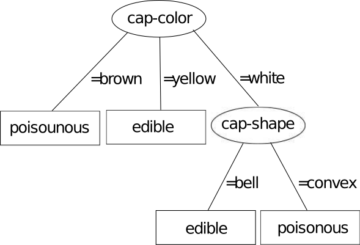

# Decision Trees

Aquest document descriu **Decision Trees**, la pràctica de Haskell de 
Llenguatges de programació (edició tardor 2020).


## Presentació

Es demana que feu un programa en Haskell que permeti construir arbres de 
decisió (*decision trees*) a partir d'un conjunt de dades i, un cop obtingut 
l'arbre, classificar exemples mai vistos. La figura següent mostra un exemple
d'arbre per discernir si un bolet és comestible (*edible*) o verinós 
(*poisonous*):



Els arbres de decisió són un algorisme clàssic de l'aprenentatge automàtic 
(*Machine Learning*). Podeu trobar una descripció pas a pas del seu 
funcionament des de la transparència 35 a la 40 del document següent:

Gerard Escudero, 2020. [Machine Learning (secció Decision Trees, p 35-40)](https://gebakx.github.io/ml/#35).

## Dades

Els algorismes d'aprenentatge automàtic requereixen un conjunt de dades per 
construir els seus models.

En aquesta pràctica haureu de processar el conjunt de dades 
*[Mushroom](https://archive.ics.uci.edu/ml/datasets/Mushroom)*.
Aquestes dades corresponen a una matriu de 8124 files per 23 columnes.
Cada fila correspon a un bolet. Una de les columnes és la classe (si és verinós
o comestible) i la resta corresponen als atributs (característiques) del
bolet. Es diu que tots aquests atributs són nominals (*strings*).

La taula següent mostra el subconjunt de 7 exemples i 4 columnes a partir del
que s'ha generat l'arbre de decisió mostrat en aquest document.

| class | cap-shape | cap-color | gill-color |
|-------|-----------|-----------|------------|
| poisonous | convex | brown | black |
| edible | convex | yellow | black |
| edible | bell | white | brown |
| poisonous | convex | white | brown |
| edible | convex | yellow | brown |
| edible | bell | white | brown |
| poisonous | convex | white | pink |

## Tasques

L'objectiu de la pràctica és programar un sistema de producció per
muntar classificadors de bolets amb arbres de decisió. 
S'utilitzarà el conjunt del *mushroom* com a dades dels models.

La pràctica consistirà en dos grans blocs: la construcció de l'arbre i 
la classificació.

### Construcció d'un arbre de decisió

Aquesta funció ha de tornar l'arbre resultant, que s'ha de poder 
mostrar. Un exemple de com es podria mostrar l'arbre anterior seria:

```
cap-color
  brown
    poisonous
  yellow
    edible
  white
    cap-shape
      bell
        edible
      convex
        poisonous
```

### Classificació:

El procés de classificació ha de funcionar tipus un sistema de diàleg que
vagi recorrent l'arbre. A continuació teniu un exemple d'interacció a
partir de l'arbre exemple de dalt:

```
<system> Which cap-color?
<user> white
<system> Which cap-shape?
<user> bell
<system> Prediction: edible
```

### Lectura de fitxers en Haskell:

La lectura de fitxers de text en Haskell es pot fer de forma fàcil mitjançant la funció:

```
readFile :: FilePath -> IO String
```

Així, si volem fer un programa que mostri per pantalla el contingut 
d'un arxiu de text només hem fer quelcom com:

```
main :: IO ()
main = do
    contents <- readFile "exemple.txt"
    putStrLn contents
```

La funció `lines` us pot ser de gran utilitat:

```
lines :: String -> [String]
```

## Lliurament

Només heu de lliurar un fitxer ZIP que, al descomprimir-se,
generi els fitxers següents:

- `dts.hs`: el codi del vostre programa,

- `README.md`: la documentació de la vostra pràctica,

- `*.png` si cal adjuntar imatges a la documentació.

Res més. Sense directoris ni subdirectoris.

El codi s'ha de poder compilar i generar un executable amb la comanda
`ghc dts.hs`. Totes les funcions i
definicions de tipus han d'estar
documentades en el propi codi amb comentaris adients.

El projecte ha de contenir un fitxer `README.md` que el documenti
adequadament. Vegeu, per
exemple, [aquest document](https://gist.github.com/PurpleBooth/109311bb0361f32d87a2). Si us calen
imatges al `README.md`, deseu-les com a fitxers PNG.

El lliurament s'ha de fer a través del Racó, abans del **dilluns 23 de novembre a les
23:59**.

## Referències

- Gerard Escudero, 2020. *[Machine Learning](https://gebakx.github.io/ml/)*.

- Jeff Schlimmer, 1981. *[Mushroom Data Set](https://archive.ics.uci.edu/ml/datasets/Mushroom)*.
[UCI Machine Learning Repository](https://archive.ics.uci.edu/ml/index.php).

## Observacions

- L'enunciat deixa obertes moltes qüestions intencionadament. Sou els responsables de prendre les vostres
pròpies decisions i deixar-les reflectides adientment al codi i a la
documentació. Un exemple d'això serien els diferents heurístics aplicats en cas d'empat.

- Intenteu desacoblar tant som sigui possible l'entrada/sortida del càlcul.

- Es valorarà l'ús de funcions d'ordre superior i de les construccions pròpies a Haskell.

- S'utilitzaran programes detectors de plagi per detectar possibles còpies.

- Per evitar problemes de còpies indesitjades, no pengeu el vostre projecte en repositoris
públics. Si us cal un repositori GIT, useu [GITLAB
FIB](https://gitlab.fib.upc.edu/users/sign_in).
